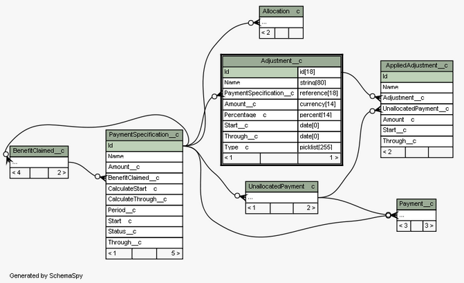

# force-metadata-jdbc-driver

## Introduction

This Java code allows a Salesforce org's schema to be exported via the wonderful [SchemaSpy](http://schemaspy.sourceforge.net/) that produces multiple elegantly formatted ERDs linked together by web pages containing all the detail. It was originally shared via this [Google Code Project](https://code.google.com/archive/p/force-metadata-jdbc-driver/), but that moved into an archive mode in 2016.

An example diagram:



## Building

Use Ant to generate the Jar file: the script merges all the classes into one Jar file. Or use your favourite Java IDE to accomplish the same thing.

## Using

Here is how to generate the SchemaSpy output for your Salesforcr org:

* Download the [SchemaSpy jar](http://schemaspy.sourceforge.net/)
* Download and install [Graphviz](http://www.graphviz.org/) that is used by SchemaSpy to create the automatically laid out diagrams; multiple platforms including Windows and Mac are supported
* Build the Force Metadata JDBC driver jar (see previous section)
* In the folder that contains the jars just enter this (replacing the arguments that start with "My" with your own values and entering it all on one line):
```
java -cp schemaSpy_5.0.0.jar;force-metadata-jdbc-driver-2.0.jar net.sourceforge.schemaspy.Main -t force -u MyUserName -p MyPasswordAndSecurityToken -font Arial -fontsize 8 -hq -norows -o doc -db MyDbName -desc "Extracted from MyDbName"
```
The arguments are documented in the SchemaSpy web site. The only change needed for Mac/Unix is the `-cp` argument separator changing from `;` to `:`.

By default all custom objects are output. The set of objects that are output can be customized by adding a `-connprops` argument. (This awkward mechanism has to be used because SchemaSpy only passes this argument through to the JDBC driver.) Here is an example that outputs two standard objects in addition to all the custom objects:
```
... -connprops excludes\=;includes\=Account,Contact
```
On Mac/Unix bash this would need to be:
```
... -connprops excludes\\=\;includes\\=Account,Contact
```
More details of how the -connprops can be used including how to change the URL to for example connect to a sandbox org are in the original usage page. (Note that the property to achieve this is url which is in lower case.)

## Original Documentation

See:

* [original usage page](https://code.google.com/archive/p/force-metadata-jdbc-driver/wikis/Useage.wiki)
* [later usage page](https://code.google.com/archive/p/force-metadata-jdbc-driver/wikis/UsageForV2.wiki)
* [issues](https://code.google.com/archive/p/force-metadata-jdbc-driver/issues)
